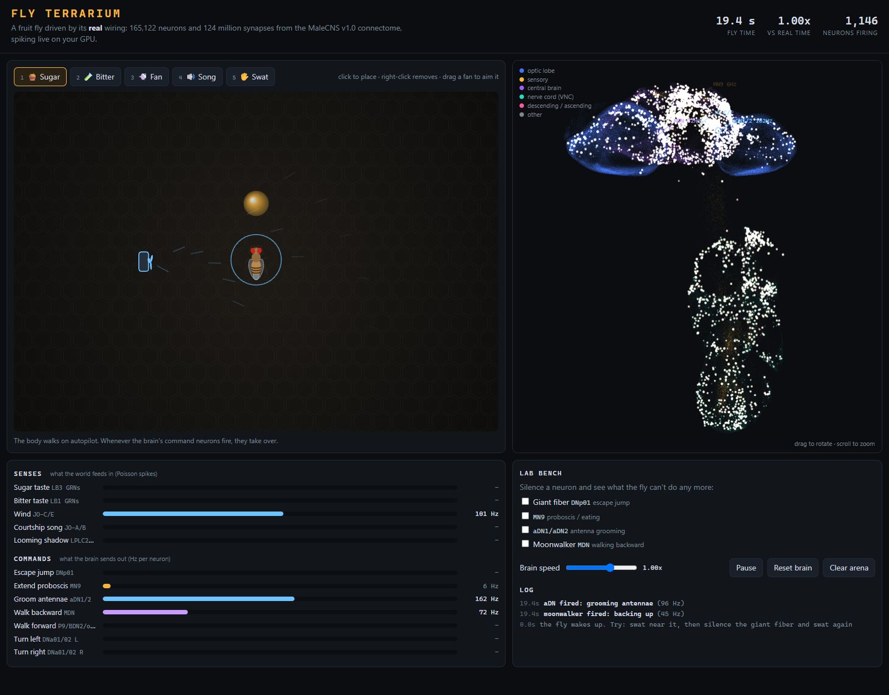

# Fly Terrarium

A cartoon fruit fly in a tank, driven by the **real wiring of a male fruit fly's whole nervous
system**: the MaleCNS v1.0 connectome (Google + HHMI Janelia, released 2026-09-03). That's
165,122 neurons and 23.8M connections simulated as spiking neurons on the GPU, at real time (tested on an RTX 5090).



## Run it
Needs Python 3.11+ and an NVIDIA GPU (it falls back to CPU, but far slower than real time).

```
pip install -r requirements.txt        # for a CUDA build of torch, see pytorch.org
python prep.py                          # first time only: downloads ~1.1 GB and builds data/brain.npz
python server.py                        # opens http://127.0.0.1:8793
```
On Windows, `play.bat` does the last two steps for you.

In the page you can:
- drop **sugar** or **bitter**, place a **fan** (drag to aim it), play **courtship song**, or **swat** at the fly
- watch all 165k neurons light up in 3D (drag to rotate, scroll to zoom)
- on the **Lab bench**, silence a neuron (for example the giant fiber) and see what the fly can't do any more
- `?demo=feed|bitter|wind|swat` sets up a scene

## What's real and what's cartoon

| Real (from the connectome) | Cartoon (hand-written) |
|---|---|
| All wiring, synapse counts, and + / - from predicted transmitters | The body, arena, and drawing |
| Whether taste, wind, song or shadows make the fly eat, groom, back up or jump | How senses turn into spike rates (contact = 150 Hz, etc.) |
| Neuron positions in the 3D view | Walking autopilot when no command neuron is firing |

Checked responses (`python sim.py`):

| Stimulus | Brain output |
|---|---|
| Sugar (LB3 taste neurons) | MN9 feeding motor neuron at ~130 Hz |
| Bitter (LB1) | Moonwalker MDN, backs away at ~55 Hz |
| Sugar + bitter | Feeding vetoed, backs away |
| Wind (Johnston's organ C/E) | aDN grooming at ~250 Hz, plus backing up |
| Looming (LPLC2/LC4) | Giant fiber DNp01 at ~415 Hz, within 60 ms |

## Files
- `prep.py`: raw download -> `data/brain.npz` + `data/neurons.json` (run once)
- `sim.py`: the LIF brain on the GPU (run it alone for the sanity experiments)
- `server.py`: runs the brain at real time and serves `web/`
- `web/`: page, arena + body (`app.js`), 3D brain (`brain.js`)
- `data/` (not in the repo): what `prep.py` downloads and builds

See `NOTES.md` for the model, the calibration story, and ideas for what's next.

## Credits
- **Connectome data:** MaleCNS v1.0 from HHMI Janelia FlyEM and Google, licensed
  [CC-BY 4.0](https://creativecommons.org/licenses/by/4.0/). Paper: "Sexual dimorphism in the complete
  connectome of the *Drosophila* male central nervous system", *Cell* (2026), doi:10.1016/j.cell.2026.08.015.
  Data: https://male-cns.janelia.org. This repo doesn't redistribute the data. `prep.py` downloads it
  from the official bucket, and every change the model makes to the wiring is described in `NOTES.md`.
- **Neuron model:** leaky integrate-and-fire parameters from Shiu et al. (2024), "A Drosophila computational
  brain model reveals sensorimotor processing", *Nature*. Code: https://github.com/philshiu/Drosophila_brain_model
- This is a toy for exploring, not a scientific result. See "What's real and what's cartoon" above.
